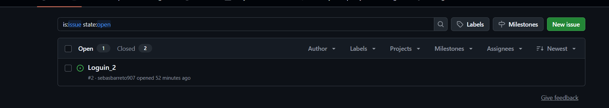
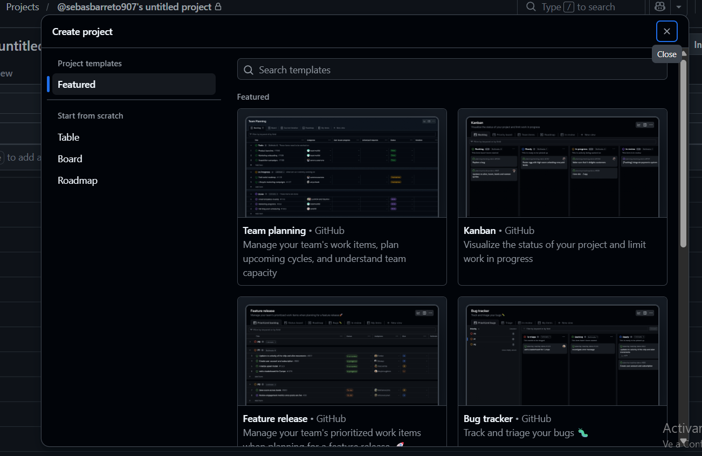
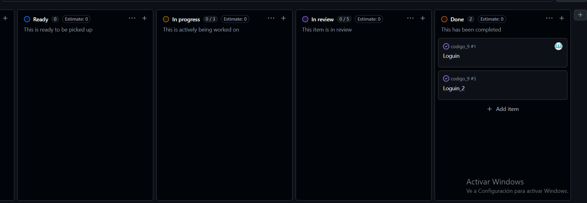

# Isuess 
## Isuess usados en la segunda clase del curso 

Paso 1: Crear un Issue (La Tarea)
El primer paso es registrar la tarea o el error que vas a resolver en tu repositorio.

Entra a tu repositorio en GitHub y haz clic en la pestaña Issues (en la barra superior, al lado de Code).

Haz clic en el botón verde New issue (Nuevo issue).

Escribe un Título claro (por ejemplo: Diseñar el componente del Footer) y una Descripción breve de lo que necesitas hacer.

(Opcional) En el panel de la derecha, puedes asignarte la tarea en Assignees o ponerle una etiqueta en Labels (como enhancement o bug).

Haz clic en Submit new issue. ¡Listo! Tu tarea ya tiene un número (por ejemplo, #1).

Paso 2: Crear el Tablero Kanban (GitHub Project)
Ahora vamos a crear la pizarra visual para organizar tus Issues.

En la barra superior de tu repositorio, haz clic en la pestaña Projects y luego en el botón New project.

GitHub te dará opciones; selecciona la plantilla Board (Tablero). Esta es la que viene con la estructura Kanban de tres columnas: Todo, In Progress y Done. Haz clic en Create.

Ponle un nombre a tu proyecto (por ejemplo: Desarrollo Fase 1).

Para añadir el Issue que creaste en el Paso 1:

En la parte inferior de la columna Todo, haz clic en + Add item.

Escribe el símbolo # y selecciona el Issue que creaste. Automáticamente aparecerá como una tarjeta en esa columna.

Paso 3: Hacer cambios en Git y pasarlo a "Done" de forma automática
La magia de GitHub es que puedes hacer que la tarjeta se mueva sola a la columna de terminados usando un comando especial en tu terminal al subir el código.

Ve a tu entorno de desarrollo en tu computadora, crea una rama e implementa los cambios en tu código (por ejemplo, maquetar el Footer).

Cuando termines, haz el git add y prepara tu git commit.

El truco de automatización: En el mensaje de tu commit, usa la palabra clave close o fixes seguida del número de tu Issue. Por ejemplo:
